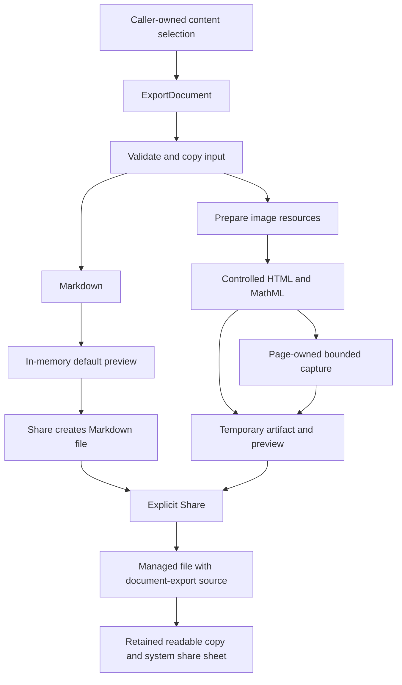

# Document Export

Document export is implemented as an application capability. Chat supplies the first document
adapter; the conversion service has no Agent, conversation, message-list, or navigation dependency.
Native capture and device acceptance remain unverified until an authorized development build and
acceptance run. No build or application test was run during implementation.

## Ownership

| Owner | Responsibility |
| --- | --- |
| `shared/contracts/documentExport.ts` | Source-neutral document, targets, artifacts, caller-owned session and capture callback |
| `backend/services/documentExport` | Validation, conversion, bounded image resources, temporary files, explicit persistence and cancellation |
| `DocumentExportRuntime` | Foreground admission, live/closing sessions and host teardown |
| `bootstrap/composition/createBackend.ts` | Connects the runtime to a file-entry store bound to the originating database |
| `frontend/appShell/documentExport` | Opens the export page and hands off a transient request; URLs contain only its ID |
| `frontend/features/documentExport` | Format choice, preview, controlled HTML capture and user-triggered delivery |
| `frontend/features/chat/share` | Current exchange reads, thinking inclusion policy and the chat-to-document adapter |
| `frontend/features/library` | The existing file stream, with an additional Sharing source filter |

The service follows [Code Organization](./code-organization.md),
[Runtime Ownership](./runtime-ownership.md), and the
[workflow contract rules](../../src/shared/contracts/README.md). `Backend.documentExport` is its
only frontend workflow boundary. This is a callable application capability; it is not registered as
an Agent tool or MCP tool.

## Pipeline



There is an explicit target switch, not a plugin or job registry. Markdown/HTML can be produced by a
programmatic caller without mounting a page. Image output requires a capture callback; the backend
never imports a React component, holds a native view reference, or opens navigation.

## Document And Session Contract

The document has an optional title, ordered sections, optional section headings/metadata, and
blocks of Markdown, images, attachments, details, or references. Images refer to entries in its
asset map. Asset sources are managed file IDs or remote image URLs. Ordinary Markdown image
references are discovered by the Markdown parser when rendering HTML, so code examples do not
cause downloads. There is no special inline asset URL scheme in this implementation; callers use
explicit image blocks for managed files.

The convenience input `{ kind: 'markdown', source, title? }` normalizes to the same document model.
Input values are copied before use; later mutation by the caller cannot change the source text.
Resources become byte snapshots on their first successful read. Failed image reads stay retryable.

```ts
const session = backend.documentExport.createSession({
  kind: 'markdown',
  source: '# Notes\n\nDocument content.',
});
try {
  const previewText = session.markdown; // No files or image reads.
  // An explicit persistence/delivery action materializes the file.
  const artifact = await session.render({ format: 'markdown' });
  const file = await session.save(artifact);
} finally {
  await session.dispose();
}
```

`render` accepts an optional abort signal and semantic progress callback. HTML/image targets require
explicit presentation values: logical width, font size, and resolved semantic colors. The export
page freezes those values at opening so a system theme or orientation transition cannot replace a
file during delivery. Programmatic input presentation is validated and copied by the HTML renderer.

An artifact contains one file descriptor plus Markdown text, HTML text, or image dimensions. It also
contains structured image/formula issues. The returned artifact and file descriptor are frozen.
The session admits one operation at a time, including saving, and accepts only its current artifact
for persistence. A new completed render replaces the previous temporary output. Rendering Markdown
again reuses its current file and saved entry while they remain available.

## Output Behavior

| Content | Markdown | HTML and long image |
| --- | --- | --- |
| Prose, tables, lists, code | Preserve authored Markdown | Render through `markdown-it`; code wraps and tables fit the document width |
| Math | Preserve source | KaTeX produces MathML with `trust: false` and bounded expansion; unsupported formulas remain visible as source |
| Managed images | Alt/name placeholder | Embed validated PNG/JPEG bytes or show a placeholder |
| Remote images | Keep eligible external URLs | Fetch without credentials, enforce bounds and embed, or show a placeholder |
| Attachments | Name/type and eligible external link | Name/type and eligible external link; attached documents are not rasterized |
| Included process/details | Keep the summary and content | Open `details` blocks include all selected content |
| References | Portable numbered links | Numbered links and a readable URL list, including in the image |

HTML contains inline CSS and embedded displayed resources. MathML needs no downloaded fonts or
runtime script. Raw authored HTML is escaped; generated links admit only HTTP, HTTPS, and mailto
without URL credentials. A content security policy disables scripts, remote subresources and forms.
The preview disables JavaScript. The separate capture surface permits only its injected readiness
protocol and blocks navigation, file access, cookies and new windows.

Markdown is source text rather than a reconstruction of rendered HTML. Authored Markdown remains
unchanged; generated metadata and structured blocks are escaped. Managed image/attachment blocks
do not expose sandbox paths.

The parser is `markdown-it` 15.0.1. Capture uses `react-native-view-shot` 5.1.0, matching Expo SDK 57's
bundled native-module version. Math uses the existing KaTeX dependency. These choices do not imply
full visual parity with the native chat Markdown renderer.

## Limits And Capture

The initial image format is **one bounded PNG**, with no stitching or multi-page output. A document
that exceeds the budget offers HTML; Markdown remains available in the format menu.

| Resource | Limit |
| --- | --- |
| Document text | 500,000 UTF-16 code units across admitted input values |
| Sections | 128 |
| Input structure | 10,000 visited values; depth at most 24 before recursive schema parsing |
| Image sources | 32, including discovered Markdown images |
| Encoded image | 4 MiB each; 16 MiB total prepared bytes |
| Decoded image | 8 million pixels each; 16 million total prepared pixels |
| Source dimensions | At most 8192 pixels on each axis |
| Supported sources | Still PNG and JPEG; animated PNG, GIF, WebP and SVG use a placeholder |
| Embedded image text | 24 MiB of base64 references per output, including repeated references |
| Remote read | 15 seconds; redirects rejected; response stream stopped at the byte cap |
| HTML width / font size | 280–800 logical pixels / 12–24 pixels |
| Capture | At most 8192 logical pixels high and 12 million physical pixels |
| Capture readiness/native wait | 30-second logical timeout |
| Runtime sessions | At most 4 live or closing sessions; one interactive request |

Physical capture admission uses the device pixel ratio before expanding the native view. The pixel
budget can therefore produce a lower height limit on high-density devices. Reducing the PNG's
encoded size is not treated as reducing bitmap memory.

The capture surface waits for image decoding, fonts and stable layout over multiple animation
frames. It measures the document, checks width/height/pixel limits, expands the mounted wrapper,
then waits for the resized native layout and a second stable-layout report before capture. The
wrapper is non-collapsible and its parent disables clipped-subview removal. The preview displays
the produced PNG, not an HTML approximation.

Messages from the WebView must match the active request and expected dimensions. A module-local
capture lease prevents another physical capture from reusing a closing surface. Abort/timeout has
an immediate logical result; a late native file is released instead of being published. Native work
keeps its lease until its actual promise settles. These controls do not establish that off-screen
WebView rendering works on all devices; that requires the pending iOS/Android acceptance run.

## Lifetime And File Library

- `DocumentExportRuntime` is a Gate lifecycle service depending on `DbService`. Initialization
  subscribes to app state; it does not parse documents, fetch resources or mount a capture surface.
- Background/inactive transitions cancel active operations and reject new work. Returning to the
  foreground permits an explicit retry; generation never restarts silently.
- The runtime closes admission before teardown, disposes every session, and retains closing
  sessions until cleanup settles. Managed-file reads/writes use the original host's database,
  so late cancellation cannot redirect an old operation into a replacement host.
- Session scratch and its current preview live under the OS cache. A replacement render deletes
  the previous completed preview; route exit or disposal deletes session scratch. Abandoned cache
  files after process death remain disposable OS-managed cache.
- The app-shell request has a 30-second deadline before route handoff. Missing requests after
  process death show an unavailable state. Route cleanup is deferred one task so development
  remounts can reclaim the same request, then it waits for disposal before admitting another.
- Opening the page displays native Markdown from memory without generating any output file. HTML
  and PNG convert only when selected. A source can supply one initially checked option and an
  alternate document; changing it renders only the current format. Both sessions close with the route.
- **Share first commits the final artifact into the existing managed file store.** It is the page’s
  only delivery action, including for Markdown. Repeated actions on the current artifact reuse its
  saved entry. Changing formats creates a new artifact; reopening an export is a new session and
  may create another file.
- Saved files have `provenance: 'document-export'`. This extends the existing source enum without
  adding a column or database migration; older files retain their existing provenance. Sharing an
  existing managed file does not change its provenance.
- Sharing is an additional source filter over the library's existing cursor stream. Exported PNGs
  also remain in Images, while HTML/Markdown remain in Documents. There is no second table or
  separate permanent directory for sharing.
- Permanent files follow the existing [file model](./data/file-model.md): only explicit user
  deletion removes them. Closing a preview, deleting a conversation, or dismissing a share sheet
  does not delete saved files.
- System delivery uses the shared `frontend/utils/shareFile.ts` helper. It creates a readable cache
  copy and retains it after the sheet closes, since recipients can read later. Share-sheet
  completion does not claim delivery to another person. Cancelled sharing still leaves the saved
  file in Sharing. Existing file-viewer actions provide saving images to Photos and system opening.

No background jobs, process-death resume, content-hash deduplication, hosted links, PDF conversion,
attachment bundles, or multi-image sharing are introduced.

## Chat Integration

The last action in the assistant message toolbar reads the clicked answer and its same-turn
question and opens `/document-export` directly. There is no message selection page, history browsing,
or timestamp option. Markdown is the default; a compact menu switches to HTML or PNG on demand.

A single bounded around-message read (up to 200 neighbors) resolves the current exchange. It rejects
missing or unsettled content instead of silently dropping the question. Messages without a turn ID
can export their standalone answer. The toolbar shows pending feedback and blocks duplicate opens.

Visible thinking content is included by default. When present, the source supplies two immutable
document snapshots and a checkbox label so the preview can omit that content without acquiring chat
dependencies. Only the selected format is rendered for the selected snapshot.

The adapter follows the chat article's final-answer boundary. Earlier prose and reasoning are
process content; the last visible text is a final answer only when no later process part follows
it. File parts remain after the answer. The thinking option includes reasoning, intermediate prose and
readable tool names, never raw tool inputs, result envelopes, credentials or diagnostics.

Persisted `[cite:id]` references from web search/fetch outputs become ordinary numbered links.
Code examples and unknown markers remain source text. File references become document-local assets.
The generic export page has no live chat subscription and cannot load a conversation on its own.

## Validation Status

Behavior tests were added for source copying/limits, Markdown and HTML behavior, resource limits,
asset retry/reuse, temporary/permanent lifetime, stale artifact rejection, asynchronous capture
copying, late cancellation cleanup, lifecycle admission/teardown, current-exchange reads and file source persistence. Markdown lifetime
coverage also checks that preview creates no files or asset reads and repeated sharing reuses its file.
Preview-hook coverage includes lazy conversion, option changes and stale-format rejection; request
coverage checks disposal of both option snapshots. The library filter and existing
serialization/composition fixtures were updated as well.

Only formatting and lint are permitted for this task. Tests, type checks, builds, and interactive
UI/device verification were intentionally not run. The native dependency requires an explicitly
authorized development-client build before capture acceptance.

Changed-file formatting and lint for the simplified sharing flow completed without errors or
warnings. During the initial implementation, full `pnpm lint` reported seven unresolved imports
from the existing `@cherrystudio/ai-core` package, whose `dist` output is absent in this workspace,
alongside existing warnings. No package build was run to resolve that environment prerequisite.

When authorized, acceptance should cover both iOS and Android, light/dark themes, different pixel
ratios, long text, wide tables/code, inline/display math, multiple images, rejected/failed resources,
backgrounding, repeated actions, actual PNG bounds, and a recipient opening the shared file. Follow
[Testing And CI](../guides/testing-and-ci.md) and
[Parallel Device Testing](../guides/parallel-device-testing.md).
