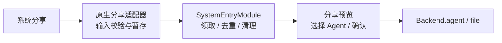

# 系统分享架构方案

状态：源代码已接入，原生构建与真机验收仍需单独授权。日期：2026-09-21。关联：[Issue #964](https://github.com/CherryHQ/cherry-studio-app/issues/964)。

## 1. 设计结论

本次系统集成只保留一个核心能力：外部应用通过系统分享把文本、链接、图片或文件交给 Cherry，
用户在应用内预览、选择 Agent 并确认后，才创建正式聊天。

- `SystemEntryModule`（系统入口模块）负责领取、校验、去重、提交和清理分享。
- App Shell（应用外壳，即负责全局导航与启动衔接的前端层）负责打开分享预览和反馈错误。
- 分享继续复用现有 Agent 与文件能力，不建立第二套聊天或文件运行时。
- 不提供桌面快捷入口、App Intent（iOS 系统快捷指令入口）或通用命令总线。

## 2. 所有权与数据流



主应用的 `Backend`（前端调用后端工作流的同进程接口）不是跨进程传输层。iOS 分享扩展运行在
独立进程中，因此先写入 App Group（应用及扩展共享的受控容器）；Android 接收页把确认后的内容
写入应用私有目录。应用启动后由唯一的前台消费者领取。

## 3. 动作契约

```ts
type SystemAction = {
  kind: 'share.receive';
  text: string;
  files: readonly SharedFileSummary[];
};
```

`SystemEntrySession`（一次已领取分享的生命周期对象）负责 Agent 准入、附件导入、原生确认和
清理。`submit()` 只能由分享预览中的明确确认触发；`dismiss()` 丢弃分享；`dispose()` 释放未消费
的领取权，让后续前台再次领取。路由只携带内存句柄，不携带正文或文件路径。

外部分享不能直接发送，也不能指定工具、模型服务商、请求地址、密钥或本地文件路径。

## 4. 分享存储与限制

- 文本最多 131,072 个 UTF-16 单元；附件最多 10 个。
- 单附件最多 25 MiB，总附件最多 50 MiB；链接只保存文字，不主动下载。
- 已确认的分享最多暂存 24 小时，完成、丢弃或过期后清理。
- iOS 文件使用完整文件保护并排除备份；Android 使用 `noBackupFilesDir`。
- 原生端限制附件必须位于本次暂存目录，JavaScript 再通过版本化 schema 校验。
- 正式导入先写身份收据，再复制到托管存储，以便进程中断后按同一标识安全重试。

## 5. 原生集成

`scripts/withSystemIntegration.js` 生成 iOS 分享扩展及 App Group 权限。Android 分享 Activity
由本地 Expo 模块注册。`app.config.ts` 按 development、preview、production 的包名隔离共享
容器；Widget 继续使用原有 App Group，不获得系统分享暂存区。

新增或修改这些原生入口后必须重新构建自定义客户端；OTA 更新和 Expo Go 不能增加原生模块或
分享扩展。

## 6. 验收重点

获得构建与设备验证授权后，覆盖冷启动和热启动分享、取消、重启与过期清理、附件上限、重复投递、
App Group 签名权限以及确认发送。自动化验证重点覆盖 `createSystemEntryModule`、原生 envelope
schema、分享导入收据和 bootstrap 释放顺序。
