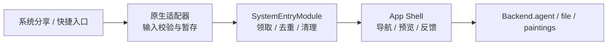

# 系统入口架构方案

状态：源代码已接入，原生构建与真机验收仍需单独授权。日期：2026-09-21。关联：[Issue #964](https://github.com/CherryHQ/cherry-studio-app/issues/964)。

## 1. 设计结论

系统入口采用“平台入口适配 → 有限业务动作 → 现有业务能力”的结构：

- `SystemEntryModule`（系统入口模块）统一领取、校验、去重和移交外部动作。
- App Shell（应用外壳，即负责全局导航与启动衔接的前端层）负责导航、分享预览和反馈。
- 分享、聊天和绘画复用现有 Agent、文件与绘画能力，不建立第二套业务运行时。
- 原生适配器只接受白名单动作，不提供通用命令总线、HTTP 服务或任意 RPC。

## 2. 产品入口

| 用户入口 | 业务动作 | 行为 |
| --- | --- | --- |
| 分享文本、链接、图片或文件 | `share.receive` | 预览并选择 Agent，确认后创建正式聊天 |
| iOS 新聊天快捷指令 | `chat.open` | 打开指定 Agent 的新草稿 |
| iOS 询问 Cherry | `chat.ask` | 打开应用并使用现有 Agent，成功后向快捷指令返回文本 |
| Android 长按图标 | `chat.open` / `painting.open` | 打开聊天草稿或绘画页面 |

外部分享不能直接发送，也不能指定工具、模型服务商、请求地址、密钥或本地路径。只有应用声明的
iOS App Intent（系统快捷指令入口）可以触发 `chat.ask`，并继续遵循应用内工具审批。

## 3. 所有权与数据流



主应用的 `Backend`（前端调用后端工作流的同进程接口）不是跨进程传输层。iOS 分享扩展运行在
独立进程中，因此先写入 App Group（应用及扩展共享的受控容器）；Android 接收页把确认后的内容
写入应用私有目录。应用启动后再由唯一的前台消费者领取。

## 4. 动作契约

```ts
type SystemAction =
  | { kind: 'chat.open'; agentId?: string }
  | { kind: 'chat.ask'; agentId?: string; text: string }
  | { kind: 'painting.open' }
  | { kind: 'share.receive'; text: string; files: readonly SharedFileSummary[] };
```

`SystemEntrySession`（一次已领取系统动作的生命周期对象）负责 Agent 准入、提交、原生确认和清理。
`complete()` 表示目标已接管；`dismiss()` 丢弃分享；`dispose()` 释放未消费的领取权并取消该入口
拥有的询问。路由只携带内存句柄，不携带正文、文件路径或其他敏感内容。

## 5. 分享存储与限制

- 文本最多 131,072 个 UTF-16 单元；附件最多 10 个。
- 单附件最多 25 MiB，总附件最多 50 MiB；链接只保存文字，不主动下载。
- 已确认的分享最多暂存 24 小时，完成、丢弃或过期后清理。
- iOS 文件使用完整文件保护并排除备份；Android 使用 `noBackupFilesDir`。
- 原生端限制附件必须位于本次暂存目录，JavaScript 再通过版本化 schema 校验。
- 正式导入先写身份收据，再复制到托管存储，以便进程中断后按同一标识安全重试。

## 6. 原生集成

`scripts/withSystemIntegration.js` 生成 iOS 分享扩展、App Intent 资源、App Group 权限和 Android
快捷入口。`app.config.ts` 按 development、preview、production 的包名隔离共享容器。Widget
继续使用原有 App Group，不获得系统分享暂存区。

新增或修改这些原生入口后必须重新构建自定义客户端；OTA 更新和 Expo Go 不能增加原生模块、
扩展或系统快捷入口。

## 7. 验收重点

获得构建与设备验证授权后，覆盖冷启动和热启动分享、取消、重启与过期清理、附件上限、重复投递、
iOS App Intent 发现与超时取消、App Group 签名权限，以及 Android 长按图标导航。自动化验证重点
覆盖 `createSystemEntryModule`、原生 envelope schema、分享导入收据和 bootstrap 释放顺序。
