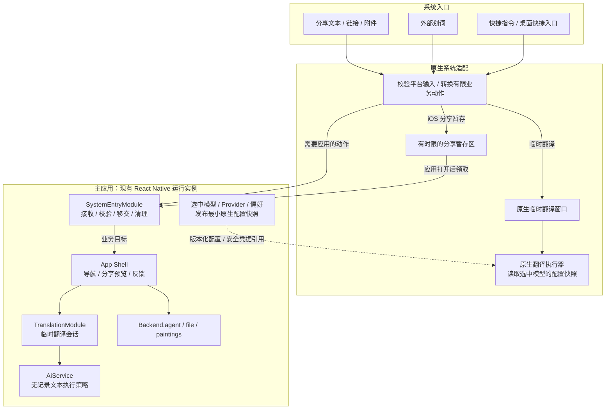
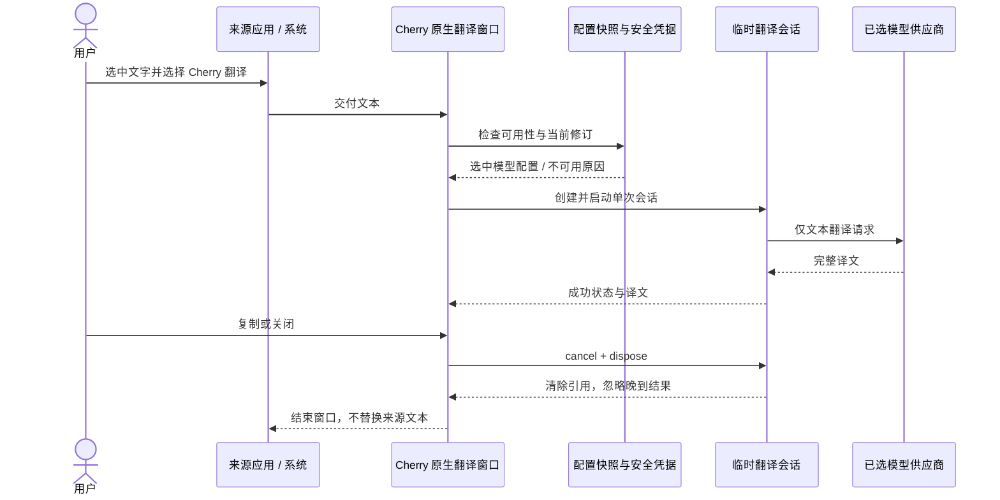

# 系统入口与临时翻译架构方案

状态：源代码已接入，两端开发构建通过，模拟器验收部分通过；已知阻断和未验证项见第 11 节。日期：2026-09-17。关联：[Issue #964](https://github.com/CherryHQ/cherry-studio-app/issues/964)。

## 1. 设计结论

系统集成分成两个方向：**系统调用 Cherry**，以及 **Cherry 调用设备能力**。本次新增前者，
后者继续由现有 Agent（负责对话和工具调用的智能体）及设备能力模块管理。

采用“平台入口适配 → 明确的业务动作 → 现有业务能力”的结构：

- `SystemEntryModule`（系统入口模块）统一接收、校验、去重和移交外部动作；应用导航仍由前端负责。
- `TranslationModule`（临时翻译模块）统一模型选择规则、一次翻译的生命周期、结果和错误语义。
- 原生扩展实现同一套业务语义，但不假设能够访问主应用的 `Backend`（前端调用后端工作流的同进程接口）。
- 分享、普通聊天、绘画继续复用现有文件、Agent、绘画能力；临时翻译不创建聊天、消息或持久任务。
- 不引入万能命令总线，不把所有设备工具重新包装成系统动作，也不增加第二套聊天引擎。

**统一的是动作、配置来源和行为契约；执行进程、系统界面与平台限制仍然明确可见。**

## 2. 当前代码基础

| 已有能力 | 现状与本次用法 |
| --- | --- |
| 三类前后端接口 | 数据读写走 Data API（类型化资源接口），偏好走 `PreferenceClient`，多步骤工作流走 `Backend`；保持现有边界 |
| 应用启动 | `AppBootstrapProvider` 创建并持有一个运行实例；新增系统入口消费者接入现有生命周期 |
| 翻译模型 | 已有 `feature.translate.model_id`，`ModelSettingsScreen` 已展示；应用内和原生窗口复用此选择 |
| 非聊天 AI 调用 | `AiService.generateTemporaryText` 复用指定模型生成管线，固定使用无记录策略 |
| 调用用量记录 | 普通 `generateText` 保留 `createAiUsagePlugin`；临时翻译不安装此插件 |
| 聊天 | `Backend.agent` 创建和执行正式会话；新聊天草稿为 `{ kind: 'draft', agentId }`，首次发送才创建会话 |
| 文件 | `Backend.file` 已负责临时 URI（系统提供的文件访问地址）导入、托管存储和提交时解析 |
| 绘画 | 已有页面路由和持久任务执行；桌面快捷入口只打开页面，不直接生成 |
| iOS 共享容器 | 新增独立 App Group（应用及指定扩展共享的容器）和 Keychain 访问组；按构建配置隔离，Widget 不获得翻译密钥 |
| 原生集成 | 已有 `modules/*` 本地 Expo 模块模式；新增系统适配沿用该模式 |
| 设备能力 | 已有日历、iOS 提醒事项、健康数据读取、位置等能力，继续遵循现有权限和工具审批 |

代码依据：[Backend](../../src/shared/contracts/backend.ts)、[接口约束](../../src/shared/contracts/README.md)、
[启动所有权](./runtime-ownership.md)、[AiService](../../src/backend/ai/AiService.ts)、
[模型设置](../../src/frontend/features/settings/model/ModelSettingsScreen.tsx)、
[模型偏好映射](../../src/frontend/components/ModelPicker/utils/modelSettings.ts)、
[文件接口](../../src/shared/contracts/file.ts)、[设备工具](./agent/agent-tools-and-resources.md)。

## 3. 产品入口与执行边界

| 用户入口 | 业务动作 | 展示与执行位置 | 是否保存业务记录 |
| --- | --- | --- | --- |
| Android 外部划词 → Cherry 翻译 | 临时翻译 | 原生对话框式 Activity（Android 承载窗口的页面组件），保留来源应用上下文 | 否 |
| iOS 外部划词 → 翻译 | 临时翻译 | iOS 18.4+ 的系统翻译扩展界面；用户需先将 Cherry 设为默认翻译应用 | 否 |
| 分享纯文本 → 临时翻译 | 临时翻译 | 分享扩展或主应用中的临时翻译界面 | 原生分享界面选翻译不落盘；已暂存普通分享在应用内转为翻译时删除暂存 |
| 分享文本、链接、图片、文件 → Cherry | `share.receive` | Android 进入应用预览；iOS 扩展先接收暂存，用户打开 Cherry 后继续预览与发送 | 仅确认导入/发送后成为正式文件或聊天；此前是有时限的暂存 |
| iOS 快捷指令：新聊天 | `chat.open` | 前台打开指定 Agent 的新草稿 | 首次发送前不创建聊天 |
| iOS 快捷指令：询问 Cherry | `chat.ask` | 前台交给现有 Agent，支持原有工具审批；成功完成时返回文本 | 是，属于普通聊天 |
| iOS 快捷指令：翻译文本 | 临时翻译 | 原生短时执行，完成后返回文本；不依赖聊天运行实例 | Cherry 不保存；结果交还快捷指令 |
| Android 长按图标：新聊天 / 绘画 | `chat.open` / `painting.open` | 主应用对应页面 | 打开页面本身不产生生成记录 |

划词首版只提供翻译。翻译窗口显示原文、目标语言、结果、当前模型，并支持复制、重试、关闭和长文本滚动。
源语言自动识别；目标语言优先使用本次输入，其次使用用户保存的偏好，最后使用已解析的应用界面语言。
窗口内切换语言仅对本次窗口生效；默认目标语言和模型修改在主应用设置中完成。

iOS 的小窗口是系统承载的翻译界面，不是任意位置的全局悬浮窗。Android 使用普通对话框式 Activity，
不申请悬浮窗权限。入口是否出现在选中文字菜单中，还取决于来源应用是否提供对应系统操作。
依据：[Apple 默认翻译应用](https://developer.apple.com/documentation/translationuiprovider/preparing-your-app-to-be-the-default-translation-app)、
[Android ACTION_PROCESS_TEXT](https://developer.android.com/reference/android/content/Intent#ACTION_PROCESS_TEXT)。

## 4. 结构与所有权



图中的动作接口是共同规范，不表示跨进程共享一个 TypeScript 对象。主应用的 `Backend` 仍然是同进程接口；
iOS 扩展拥有独立进程，Android 临时 Activity 的生命周期也独立于主应用页面。

### 原生翻译的实现选择

外部小窗口采用 Swift / Kotlin 原生界面及短时翻译执行器。它只负责选定协议的单次文本请求，
不启动 JavaScript、SQLite、Agent、MCP（外部工具连接层）或持久任务运行实例。
应用内翻译继续复用 `AiService`。双方遵守同一份输入、提示词规则、能力清单、取消和错误规范。

| 选择 | 判断 |
| --- | --- |
| 扩展转发给主应用执行 | 不采用：主应用可能未启动或被挂起，无法作为可靠的翻译服务器 |
| 在每个小窗口启动完整 React Native 应用 | 不采用：现有启动依赖页面及启动遮罩，容易重复创建后端实例；iOS 还需承担独立引擎的资源成本 |
| 原生小执行器 + 应用内已有 AI 管线 | 已采用：冷启动和关闭行为独立明确；代价是需要维护受限的原生供应商协议实现 |

这项选择意味着**原生翻译兼容范围必须作为产品能力展示**。如果需要首版即支持所有现有供应商，
应重新评估独立可移植 AI 执行核心及其 iOS 扩展资源成本，不能通过扩大类型声明假装已经支持。

## 5. 统一动作与接口

以下摘录当前接口；完整类型以 [SystemEntry](../../src/shared/contracts/systemEntry.ts) 和
[Translation](../../src/shared/contracts/translation.ts) 为准。`systemEntry` 不作为所有前端业务的必经入口，
普通页面继续直接使用已有业务接口。

### 动作模型

```ts
type SystemAction =
  | { kind: 'chat.open'; agentId?: string }
  | { kind: 'chat.ask'; agentId?: string; text: string }
  | { kind: 'painting.open' }
  | { kind: 'share.receive'; text: string; files: readonly SharedFileSummary[] };
```

- 临时翻译不进入系统动作队列：原生入口直接执行，应用内分享预览通过内存句柄打开翻译页。
- 分享动作提供正文及附件摘要（标识、名称、媒体类型、大小），不暴露本地文件路径。
  页面通过内存句柄领取会话，正文、文件内容和密钥不进入路由 URL。
- `chat.ask` 仅允许来自应用声明的快捷指令入口。普通链接、分享 Intent（Android 系统动作消息）
  或未知外部调用不能自报来源来获得自动发送权限；它们只能打开预览。
- `chat.open` 使用现有草稿路由，不向输入框写入外部内容；已有草稿不被外部正文覆盖。
  目标 Agent 已删除时提示用户并进入 Agent 页面重新选择。
- 不支持调用者指定任意工具名、Provider（模型服务供应商）配置、请求地址、密钥或本地文件路径。
- 能力检查由实际接收适配器确定入口类别；`source` 等来源文字仅供展示，不能作为授权凭据。

### 主应用入口模块

```ts
interface SystemEntryModule {
  subscribePending(listener: () => void): () => void;
  claimNext(): Promise<SystemEntrySession | null>;
  refreshShortcuts?(): Promise<void>;
}

interface SystemEntrySession {
  readonly action: SystemAction;
  readonly settled: Promise<void>;
  resolveAgent(): Promise<string | null>;
  submit(agentId: string): Promise<{ sessionId: string }>;
  complete(): Promise<void>;
  dismiss(): Promise<void>;
  dispose(): Promise<void>;
}
```

App Shell（负责全应用导航和启动衔接的前端层）在后端与路由就绪后领取动作并导航。
分享由预览页在用户确认后调用 `submit()`；询问由原生 App Intent 授权后调用同一方法，
仍经过现有 Agent 的权限与审批。重复提交复用同一次接收过程。
`complete()` 表示目标已接管，不能解释为“AI 已完成”；询问仅在最终回答成功时回复原生调用者。
`dismiss()` 丢弃普通分享，`dispose()` 释放未消费的分享领取权、取消此入口拥有的询问。
`settled` 让唯一消费者串行处理交接，所有者退出时先等待取消中的接收流程完成。

`refreshShortcuts` 仅在原生端需要助手索引时提供。目前只有 iOS App Intents 消费该索引；
Android 使用静态桌面快捷入口，不查询或发布助手列表。首次同步由助手查询就绪触发，
之后在助手列表变化或应用回到前台时刷新，路由就绪不再重复刷新。

原生适配器的入队与快捷指令结果回传是模块实现依赖，不额外暴露给任意前端调用者。
仅为有限系统入口服务，不提供公共 HTTP 服务或通用 RPC（跨进程任意方法调用）入口。

### 临时翻译模块

```ts
interface TranslationModule {
  subscribeAvailability(listener: () => void): () => void;
  getAvailability(surface: TranslationSurface): Promise<TranslationAvailability>;
  createSession(input: TranslationInput): TranslationSession;
}

type TranslationInput = { text: string; targetLanguage?: string };
type TranslationSurface = 'app' | 'externalWindow' | 'shortcut';

interface TranslationSession {
  getSnapshot(): TranslationSnapshot;
  subscribe(listener: () => void): () => void;
  run(): Promise<void>;
  cancel(): void;
  dispose(): void;
}
```

`Session`（由调用窗口拥有、关闭时释放的一次工作单元）包含原文、已解析的目标语言、模型身份、
结果和状态；原生配置修订号属于内部传输协议。`TranslationSnapshot` 是 `ready / running / succeeded / failed / cancelled / disposed`
的判别联合；只有成功态包含完整译文，失败态包含稳定错误码，不携带原始供应商响应。

每次会话最多启动一次请求；重试或切换语言先释放旧会话，再创建新会话并重新检查模型配置。
首版使用非流式文本结果。输入为空、超过产品配置的大小上限、返回空结果或输出被截断时明确失败，
不静默裁剪或展示为成功。请求截止时间由执行器设置；系统提前取消时立即服从，不承诺固定后台时长。

原生窗口使用等价的 Swift / Kotlin 会话接口。业务含义相同不要求它们实现 TypeScript 接口；
通过共享行为用例约束语义一致性。

### 可用性和错误

`TranslationAvailability` 包括目标语言、可解析的模型身份，以及 `ready` 或 `unavailable` 状态。
不可用原因包括 `modelNotConfigured`、`modelUnavailable`、`providerUnavailable`、`credentialsUnavailable`、
`unsupportedProvider`、`configurationStale`、`platformUnavailable`。

执行错误另含 `invalidInput`、`inputTooLarge`、`networkUnavailable`、`authenticationFailed`、
`rateLimited`、`timedOut`、`invalidResult` 和 `failed`。取消使用独立的 `cancelled` 状态。前端及原生界面各自负责本地化文案。
自动重试、自动切换供应商和退回默认聊天模型均不属于首版行为。

### 真正的原生传输边界

在 `modules/system-integration` 定义带版本号的传输格式，用于原生到 JavaScript 的系统动作、
快捷指令的结果关联，以及分享暂存清单。格式包含协议版本、一次投递标识、创建时间和动作体；有效期由接收端固定计算。
接收时执行白名单字段及大小校验；未知版本拒绝处理。

`AbortSignal`、回调、React 对象和 `TranslationSession` 不能序列化穿过原生边界。
传输层的请求标识、确认消息和序列化校验放在原生模块旁，**不放入 `src/shared/contracts`**。
前端只看到已校验的业务值；本次不增加仅用于转发类型的共享目录。

## 6. 翻译模型、凭据与协议支持

### 唯一配置来源

`feature.translate.model_id` 继续指向一个现有模型。主应用解析模型和供应商状态，生成原生执行需要的最小快照。
快照不成为第二个可编辑配置源；扩展不能直接读取主应用 SQLite，也不能修改供应商配置。

默认目标语言新增偏好 `feature.translate.target_language`，值为语言标签或 `null`（跟随应用语言），
沿用 `PreferenceClient` 读写并纳入快照。原生窗口和快捷指令传入的语言只覆盖本次输入，
不回写偏好，避免增加跨进程偏好冲突处理。

提示词和参数参考 PC 翻译设计：`feature.translate.model_prompt` 保存带 `{{target_language}}`、
`{{text}}` 的提示词模板；`reasoning_effort` 默认 `none`，温度与 Top-P 默认不开启，保存值均为 `1`。
应用内请求和原生配置发布共用模型能力解析：支持关闭思考时才生成对应关闭字段，不支持时省略；
不支持的自动思考选择回到供应商默认，强度选择按模型支持的档位解析。采样参数仅在用户开启且模型允许时发送。

原生可用配置升级至版本 2，携带模板与已解析的 HTTP 请求参数；Swift / Kotlin 仅替换模板占位符，
以单条用户消息直接请求供应商。原文中的占位符不会被再次替换。不能映射到原生协议的 SDK 选项明确拒绝。
版本 1 配置不再执行，升级后需要打开主应用重新发布一次；随后系统翻译仍可在主应用未运行时独立完成。
参数修改与模型、凭据修改一样，先使旧配置失效并取消旧请求，再保存和发布新配置。

参考来源为 PC 提交 `8d8649f34806ed89225cbcb2b6eb561e996043c7` 的翻译偏好与请求解析。
本次只对齐上述配置语义，保留移动端临时翻译的非流式、无记录和受限原生协议；不宣称已移植 PC 的全部入口或供应商分支。

快照包含：格式版本、配置修订号、模型标识与显示名、规范化请求端点、线上模型标识、
目标语言、界面语言、提示词模板和已解析的请求参数。版本 2 固定为 Chat Completions；构建隔离由容器和凭据组负责。
密钥及敏感请求头存入安全凭据区，不放普通共享文件、URL、日志或快捷指令参数。

设置页同时展示“应用内可用”和“外部翻译可用”。保留用户已有模型选择；如果协议尚不受原生支持，
明确提示原因并让用户选择兼容模型，不偷偷清空设置或更换模型。外部窗口只显示当前模型和设置指引。

### 首版原生协议范围

原生执行器首版仅实现 **OpenAI Chat Completions 兼容协议**，实际供应商仍需验收：
HTTPS、明确的最终端点、文本输入输出和标准 Bearer 密钥认证。供应商名称包含“OpenAI”并不足以判定兼容，
必须检查实际配置和模型能力；错误、非文本输出和截断结果也需要符合适配规则。

Responses API、Anthropic、Gemini、Azure、Bedrock、Vertex、本地 HTTP、OAuth、签名认证、特殊请求改写和
自定义认证暂不宣称原生兼容。是否增加某项以真实用户配置和独立协议适配验收为依据。
多密钥轮换在原生首版不实现：配置发布阶段选取列表中的第一个已启用且非空的凭据，快照生命周期内固定，失效时明确报错。

这是当前原生实现的交付限制。主应用仍可通过已有 `AiService` 支持更广的供应商。
认证、响应结构、提示词版本及错误映射的共同行为应有跨语言用例；不从 SDK 内部对象反射生成原生请求。

### 发布与失效

1. `modelConfigurationChanges` 在模型、供应商、凭据、翻译参数和语言偏好写入前通知配置所有者。
   所有者取消应用内活跃请求，等待已经开始的原生发布结束，再撤销原生快照和旧凭据，最后允许事实来源写入。
   这避免旧发布越过失效步骤、恢复已撤销凭据；并发写入全部结束后才发布新快照。
2. iOS 的秘密存于独立 Keychain（系统安全凭据存储）访问组，使用 `WhenUnlockedThisDeviceOnly`；
   配置与分享容器开启完整文件保护并排除备份。Android 在 `noBackupFilesDir` 保存 AES-GCM 加密快照，
   密钥由 Keystore 管理；设备锁定时拒绝读取。Widget 不在新凭据组中。
3. 原生写入先失效，再写新凭据和原子快照。窗口请求前读取完整配置，执行中每 400 毫秒检查修订号，
   发布结果前再检查一次；修订变更时取消旧请求。已发出的远端请求无法通过本地失效撤回。
4. 主应用启动重新发布快照，正常关闭保留最后一次配置，供独立原生调用使用。
   开发、预览和正式安装使用不同应用标识、容器和凭据组。快照排除备份，恢复后需打开应用重新同步；
   iOS 遗留 Keychain 项没有对应快照时不能单独启用翻译。
5. 发布失败显示 `configurationStale`，不退回旧快照。重新启动 Cherry 或再次保存相关配置会触发同步。
   当前写入边界覆盖现有模型/供应商/偏好入口及远端目录激活；将来新增直接数据库恢复或全量替换入口时，
   必须接入同一失效边界。当前不宣称已有安装 nonce 校验或任意数据库替换检测。

实现依据：[Apple Keychain 共享访问](https://developer.apple.com/documentation/security/sharing-access-to-keychain-items-among-a-collection-of-apps)。

## 7. 临时翻译生命周期与不留记录



业务保证是 Cherry 不持久化这次翻译：

- 不创建 Agent Session、消息、Job（可恢复的持久工作记录）、翻译历史或每次调用的用量/费用记录。
- 不把原文、译文、提示词、密钥或原始网络错误写入日志、崩溃附件、分析事件、文件缓存、URL 和恢复状态。
- 应用内复用 `AiService` 时，由专用翻译依赖固定选择无记录策略，排除用量插件、工具调用和内容追踪；
  不开放让外部输入随意切换审计策略的参数。原有聊天调用维持当前行为。
- 原生网络会话关闭磁盘缓存和响应持久化；窗口状态不写 Android 的保存状态或页面恢复存储。
  窗口离开活动状态时清除页面内容并取消请求，Android 另设 `FLAG_SECURE`；无窗口快捷指令由本次系统调用的取消和截止时间控制。
  进程被系统杀死后不恢复翻译。
- 关闭、取消、重试和语言切换使旧会话失效，晚到结果不得重新写回界面。重复投递只在存活会话内去重，
  不为临时翻译建立磁盘去重账本。
- 只有用户主动点击复制才写剪贴板。快捷指令返回值离开 Cherry 后由系统及后续动作处理。

该保证不声称可以清除来源应用、模型供应商、系统快捷指令或剪贴板自己的记录；也不声称托管内存能够安全覆写。
产品文案应准确表述“Cherry 不保存翻译记录”。

## 8. 分享接收、冷启动和重复投递

分享与临时翻译需要不同的保存策略。普通分享为完成跨进程移交，可使用有时限的暂存；
临时翻译不能复用会落盘的分享队列。

- 原生收到普通分享后及时复制允许读取的附件，保留文本、链接及多附件的原始结构；
  不依赖短期 URI 授权在进程重启后仍存在，也不自动联网抓取链接内容。
- 纯文本在选择“交给助手”还是“临时翻译”之前仅保留内存；选临时翻译直接创建会话，
  选普通分享才进入暂存流程。选择前进程终止允许丢失，不能为了恢复能力先偷偷保存文本。
- 暂存区使用独立目录、随机标识、过期时间及字节/附件数量上限。首版保留上限 24 小时，
  完成或取消即清理；进程停止期间不能保证定时器执行，因此下次访问先删除过期项。
- 状态为 `staged → claimed → transferred`，另有 `discarded / expired`。
  领取权保存在内存；释放或进程重启后可重新领取。
  导入前原子写入仅含文件标识的收据，再复制附件；重试使用收据中的同一组标识。
- `complete()` 在目标页面或正式业务接管后调用；不能在读到系统事件时就删除来源。
  原生事件监听和冷启动读取都只触发同一领取流程，避免两条路径各执行一次。
- 用户确认发送前不调用 `Backend.agent.startSession`；发送失败且能够确认聊天未创建时清理本次托管文件、保留原生暂存和预览。
  接收结果不确定时保留收据和文件，重试先查询以入口标识命名的聊天，避免重复发送。
- 正式发送的防重复应关联现有 Agent 提交标识，在崩溃恢复时查询实际接收状态；
  没有可证明的接收状态就回到预览，不能靠自动重放来猜测，也不承诺跨系统的“恰好一次”。

iOS Share Extension（系统分享面板中的独立扩展）首版提供原生预览、“暂存到 Cherry”和纯文本“临时翻译”。
暂存后提示用户打开 Cherry 继续选择 Agent 并确认发送；不在扩展里启动完整 Agent。
这是 iOS 首版明确的体验限制，不能把“已暂存”显示成“已发送”。

当前 Expo SDK 57 的 incoming sharing（接收其他应用分享的能力）仍标记为实验性，文档说明其 iOS 实现通过
扩展打开主应用的方式并非 Apple 正式支持。该路径不作为本方案的可靠基础；
现有 `expo-sharing` 向外分享继续使用。[Expo Sharing 文档](https://docs.expo.dev/versions/v57.0.0/sdk/sharing/)

## 9. 快捷指令、系统设置与已有设备能力

### iOS 快捷指令

使用 App Intents（让系统发现并运行应用声明动作的机制）声明有限动作，并区分：

- **新聊天**：前台打开，返回动作已打开，不伪造聊天结果。
- **询问 Cherry**：在主应用目标内执行，先前台启动并等待现有后端就绪，再提交到 `Backend.agent`。
Native/JavaScript 之间使用有截止时间的内存结果关联。只在该次调用仍存活且 Agent 成功完成时返回最终文本。
  Agent 需要审批时在应用里处理；调用超时或系统取消时返回明确失败并取消这次入口发起的活动轮次，
  不以“已启动”冒充回答，不自动重新提交。已创建的正常聊天仍遵循原有持久化规则。
- **翻译文本**：原生执行器直接处理并返回译文；权限、配置或协议不满足时明确失败，不自动改走普通聊天。

最低系统版本使用对应可用的前台执行声明；较新系统的执行模式 API 必须有版本保护。
公开动作不宣称能绕开系统执行时限或在任意后台状态完成。
参考：[Apple App Intents](https://developer.apple.com/documentation/appintents)、
[执行模式](https://developer.apple.com/documentation/appintents/appintent/supportedmodes)。

### 按使用场景提供入口

不新增独立的“系统集成”设置页，也不常驻展示系统能力介绍、接入状态或协议说明。
“模型设置 → 翻译模型”保留模型选择；“翻译设置”管理默认语言、提示词、思考强度和采样参数。
窗口内目标语言选择仅对本次生效。缺少模型或连接不兼容等问题
在实际使用时提示。系统分享和快捷指令直接使用平台入口。

iOS 默认翻译应用由用户在系统设置中选择，不显示无法可靠读取的默认应用状态。
不为系统能力增加没有实际控制效果的开关。

### 设备能力与厂商适配

现有调用方向保持为：`Agent → 已授权工具 → 设备能力 → 平台 API`。
系统入口只选择已定义的应用动作；即使从 Siri 或桌面启动，也不能跳过设备权限、工具审批或 Agent 的配置。
临时翻译不挂载任何工具。

小米、荣耀、vivo、OPPO 后续如提供合适的系统入口，只新增对应适配器并映射已有动作；
具体 SDK、资格和设备支持另行评估。首版 Android 接入使用标准平台接口，不增加厂商 SDK 或 Google Play 服务依赖。

## 10. 当前代码落点

| 位置 | 责任 |
| --- | --- |
| `src/shared/contracts/systemEntry.ts` | 主应用入口领取会话及业务结果；无原生传输消息 |
| `src/shared/contracts/translation.ts` | 临时翻译输入、可用性、状态和会话接口 |
| `src/backend/services/systemEntry/` | 主应用入口领取、暂存文件生命周期和接管协调 |
| `src/backend/services/translation/` | 配置解析、会话生命周期；AI 执行依赖由 bootstrap 注入 |
| `src/backend/ai/` | 现有文本生成的无记录执行策略与共享翻译请求规则，不新增聊天引擎 |
| `src/bootstrap/composition/` | 组装两个工作流模块及具体依赖 |
| `src/bootstrap/runtime/` | 入口订阅、配置同步的启动/停止；消费者先停止再释放底层资源 |
| `src/frontend/appShell/systemEntry/` | 就绪后领取动作，转成导航和页面上下文；不读取原生数据库 |
| `src/frontend/features/translation/` | 应用内临时翻译页面及会话所有权 |
| `src/frontend/features/systemShare/` | 分享预览、目标选择、导入和发送 |
| `modules/system-integration/` | iOS/Android 系统适配、原生翻译会话、分享暂存、凭据桥接及真实传输格式 |
| `scripts/withSystemIntegration.js` | 声明原生目标、权限、Intent filters、构建配置隔离和 EAS 扩展清单 |

原生模块的内部目录遵循 Swift/Kotlin/Expo 的工具约定；应用源代码遵循现有命名与公共导出规则。
前端不直接导入后端或原生执行器；`services` 不反向导入 `ai`。
现有设备服务无需为了目录对称而迁移。

原生目标及权限由配置插件可重复生成，合并现有 Widget 的配置而非覆盖。主应用保持当前 iOS 最低版本；
翻译扩展及其框架引用按 iOS 18.4 的可用性隔离。应用 ID、共享容器、凭据组及 EAS 扩展清单均按构建配置派生。

## 11. 实现状态与待验收项

以下源码均已接入同一工作区。2026-09-17 已完成本地 EAS Android 开发包和 iOS 模拟器开发包构建，
并在 Android API 36 与 iOS 26.5 专用模拟器上进行部分验收：分享预览、取消清理和 Android 桌面快捷导航通过；
两端应用内翻译因 `Intl.DisplayNames` 不可用而报错，iOS 系统选词翻译收到空原文，三个 iOS 快捷动作均提示无法运行。
Android 未配置翻译模型时还显示 `null · null`。后续源码修正如下，均尚未重新进行设备验证：

- 应用语言选择器使用共享语言清单，移除对 `Intl.DisplayNames` 的依赖。
- iOS 选词扩展在 SwiftUI 视图正文中读取可观察的系统上下文，等待 `inputText` 到达后才创建翻译会话；
  选区变化时替换会话并清理旧请求，避免 `StateObject`（视图持有的状态对象）一直保留初始空原文。
  [Apple 文档](https://developer.apple.com/documentation/translationuiprovider/translationuiprovidercontext)明确将输入文字定义为可观察属性。
- Android 模型标题只接收真正的字符串，空标题隐藏；未配置或已删除模型时，应用发布的原生快照省略名称字段，
  避免桥接空值被 `JSONObject.optString` 转为文字 `null`。已有空值快照也由原生读取端兼容。

iOS 快捷指令仍未解决。只读检查 2026-09-17 的开发产物确认，三个动作及快捷指令提供者均在
`Metadata.appintents` 中，调试二进制也包含提供者符号，未发现遗漏编译或元数据的问题。
[Apple 开发者论坛](https://developer.apple.com/forums/thread/836585)有使用官方示例在 iOS 26.5 模拟器上
复现同样弹窗的报告；这是环境问题的线索，不能代替本项目的因果证据。旧记录未保存系统执行错误日志，
需在真机或其他系统版本上复验，并记录 Shortcuts/App Intents 的系统错误，才能区分环境故障和应用缺陷。
不能把这些源码修正或外部报告视为验收通过。
本轮没有可用的模型配置，真实翻译、确认发送和询问返回答案均未验证；真机签名及其他系统版本也未验证。

1. **确认原生可行性**：最小翻译扩展及 Android 对话框、主应用未运行时的配置/凭据读取、
   一种受支持协议的请求与取消、iOS 网络声明和签名，以及 App Intent 前台冷启动与结果返回。
   构建及部分入口已有上述执行证据；成功模型请求、真机签名、取消及结果返回仍需后续验收。
2. **建立翻译闭环**：翻译模型设置、能力状态、无记录会话、配置发布、主应用与外部小窗口、
   纯文本分享和快捷指令翻译。首先完成用户要求的外部划词体验。
3. **接收普通分享**：文件暂存、领取/确认/清理、应用预览、草稿隔离、正式导入和发送。
4. **补齐其他系统入口**：iOS 新聊天/询问动作、Android 新聊天/绘画快捷入口。

后续验收重点：

| 场景 | 必须观察到的结果 |
| --- | --- |
| 主应用未启动、已启动、被系统终止 | 临时翻译不依赖主应用页面；进程终止后不恢复原文 |
| iOS 扩展先收到空上下文，再收到选中文字；随后选区再次变化 | 等待输入时不发请求、不显示无效输入错误；原文随系统更新，旧请求取消且不覆盖新结果 |
| 没有模型、模型删除、凭据失效、原生不兼容 | 清晰的不同状态，不改用其他模型 |
| Android 无模型快照中的名称缺失或为 JSON 空值 | 隐藏模型标题，保留原有配置提示，不显示 `null` |
| 连续划词、重试、切换语言、关闭时网络返回 | 无交叉结果，旧会话被取消并释放 |
| 翻译成功/失败/取消 | 数据库、用量记录、缓存、日志均无该次内容或调用记录 |
| 配置发布中断、应用恢复备份、开发与正式版共存 | 不使用过期、错安装或其他构建配置的凭据 |
| 混合分享、多附件、URI 授权过期、重复系统通知 | 内容保留、无重复导入/发送、暂存可清理 |
| 已有未发送草稿、已删除 Agent 的快捷入口 | 草稿不被覆盖，失效目标可重新选择 |
| 快捷指令取消、超时或遇到工具审批 | 不虚报成功，不静默重发，不绕过原有审批 |
| iOS 17 至 18.3、iOS 18.4+、Android 不同来源应用 | 不支持的系统入口明确降级，其他功能正常 |

测试代码覆盖临时翻译生命周期、配置发布竞争、无用量记录策略、原生入口校验、分享确认及询问取消；
这些自动化测试尚未运行。原生模型协议尚未完成真实请求验证。原生目标配置及验收说明见
[System Integration 模块](../../modules/system-integration/README.md)。

首版不含 OCR、整页网页抓取翻译、来源文本替换、翻译历史、全文翻译文件、厂商助手 SDK、
后台长任务翻译和全供应商原生兼容。Issue 的早期范围未包含全部翻译设计；本次未更改远端 Issue。
